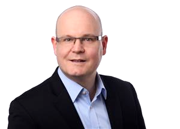

Computers fascinated me since I got a Z80 based CPC 6128 in 1985. I always wanted to find out how this thing worked
and did some programming in Basic, Pascal and Assembly Language. Later on there came a PC and C, even later C++ and Java.

After a PhD in theoretical physics (numerical simulations of hot fusion plasmas in FORTRAN) I actually started my career
as a programmer (Java 4 / J2EE), but drifted away into Project Management and Business Consulting.

After more than a decade I find myself employed by a software company and rediscover my passion for technology.
I love my job and feel like a kid left in a candy shop!

### Fields of interest

* Clean Code
* Machine Learning
* Web Technologies
* DevOps & [SRE](www.amazon.com)
* Agile Project Management
* Physical Simulations

### Professional Experience

* [Work experience](WorkExperience.md)
* [List of projects](ProjectList.md)

### Certifications

* __2017__ Project Management Level D with GPM / ...

